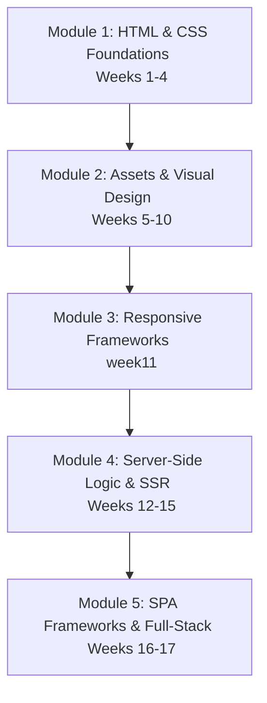

# Dynamic Documents & Front-End Web Development: Course Syllabus Summary

This document serves as a comprehensive syllabus-wide summary of the **Dynamic Documents and Front-End Web Development** course. The curriculum transitions progressively from static document structures to styled layouts, interactive components, server-side template engines, client-side frameworks, and full-stack hybrid web architectures.

---

## 🗺️ Curriculum Roadmap & Weekly Breakdown

---

## 📂 Module Details & Key Concepts

### 🔹 Module 1: Core HTML & CSS Foundations (Weeks 1 - 4)
*   **week1 (City Profiles):** Introduction to HTML5 document structures, hyperlinks, tables, media formats (`.webp`, `.avif`), and cross-document navigation.
*   **week2 (Styling Methodologies):** Implementation of visual rules via **Inline styling** versus **External stylesheets** (`style.css`), illustrating caching advantages and the *Separation of Concerns*.
*   **week3 (The Box Model & Flow):** Deep dive into the box model (`content`, `padding`, `border`, `margin`), `box-sizing: border-box`, standard document flow, and custom alignments.
*   **week4 (CSS Page Layouts):** Building complex structures using advanced lists, nested nodes, and visual layouts such as flex containers and grid systems (Horizontal, Vertical, and Grid alignments).

### 🔹 Module 2: Digital Asset Analysis & Design Realization (Weeks 5 - 10)
*   **week5 (Image Quality & Metrics):** Programmatic exploration of raster images, compiling C code to evaluate image differences using Peak Signal-to-Noise Ratio (PSNR) and Mean Squared Error (MSE) metrics.
*   **Weeks 6 - 8 (Visual Document Specifications):** Compiling research and analyzing specifications of vector/raster documents, conversion formats, and structured PDF layout guidelines.
*   **week9 (Design Replication):** Implementing exact-pixel web design specs (e.g. landing pages) using absolute coordinates, styling layers, gradients, blur filters, and typography.
*   **week10 (Project Milestones):** Packaging submissions and validating structural integrity.

### 🔹 Module 3: Responsive Layouts & CSS Frameworks (week11)
*   **week11 (Bootstrap Framework):**
    *   **Layout & Forms:** Building responsive inputs, select selectors, radio controls, and checkboxes using Bootstrap grid helpers.
    *   **Interactive Widgets:** Implementing client-side components including Accordions, Carousels, Collapse triggers, and interactive tabs using Bootstrap's JavaScript bundle.

### 🔹 Module 4: Server-Side Routing & Rendering (Weeks 12 - 15)
*   **week12 (Express Setup):** Initializing server instances, dependency tracking via Node.js, and understanding MVC structures.
*   **week13 (Dynamic Server-Side Rendering):** Generating applications using `express-generator` with **Twig** as the template engine:
    *   **Routing & Query Parsing:** Accessing GET parameters (e.g., query variables, lists, number checks).
    *   **Logic in Views:** Implementing loops (``), conditionals (``), and variables (`{{ value }}`) directly on the server to send pre-rendered HTML to browsers.
*   **Weeks 14 - 15 (Routing Refinement):** Building custom API routes, route parameters, and parsing configurations.

### 🔹 Module 5: Client-Side Single Page Applications & Full-Stack (Weeks 16 - 17)
*   **week16 (Angular SPA Client):** Transition to client-side rendering (CSR) using **Angular**. Building components, binding properties, handling custom events, and state management (e.g., password strength evaluation app).
*   **week17 (Hybrid Full-Stack Architecture):** Integrating Angular and Express.js:
    *   **Development Setup:** Running independent servers (Express on `3000`, Angular dev server on `4201` for hot reloading).
    *   **Production Deployment:** Compiling Angular build artifacts (`npx ng build --configuration production`) and serving compiled client files directly through the Express static file server middleware.

---

## 🛠️ Unified Tech Stack Summary

| Layer | Technologies & Tools |
| :--- | :--- |
| **Markups & Styling** | HTML5, CSS3 (Vanilla), Bootstrap CSS Framework |
| **Asset Formats** | WebP, AVIF, JPEG, PDF formats |
| **Backend & Routing** | Node.js, Express.js |
| **Template Engines** | Twig, server-side template controllers |
| **Frontend Frameworks** | Angular SPA, Typescript |
| **Build Tools & CLI** | npm, npx, Angular CLI, express-generator |

---

## 💡 Core Paradigms Learned
1. **CSR vs. SSR:** Understanding when to render HTML on the server (using Express + Twig) versus dynamic compilation in the user's browser (using Angular).
2. **Separation of Concerns:** Transitioning styling from HTML tags to CSS stylesheets, and separating server routes from front-end user experience templates.
3. **Responsive Web Development:** Leveraging grid models and flexible boxes to make layouts adjust seamlessly across phones, tablets, and desktop computers.
