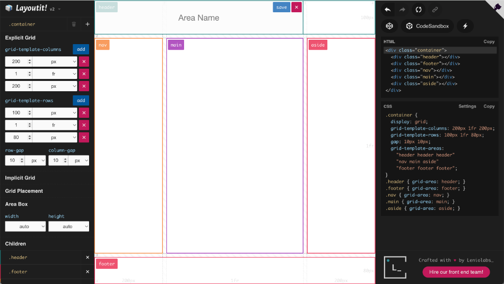
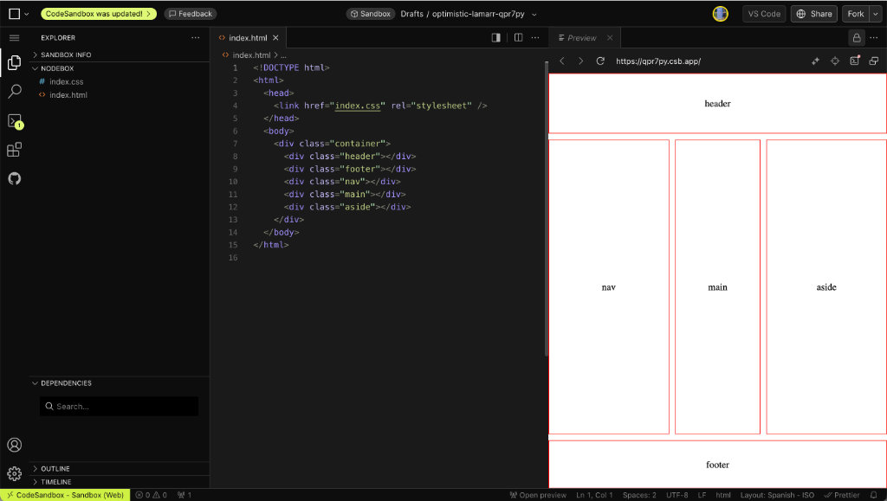
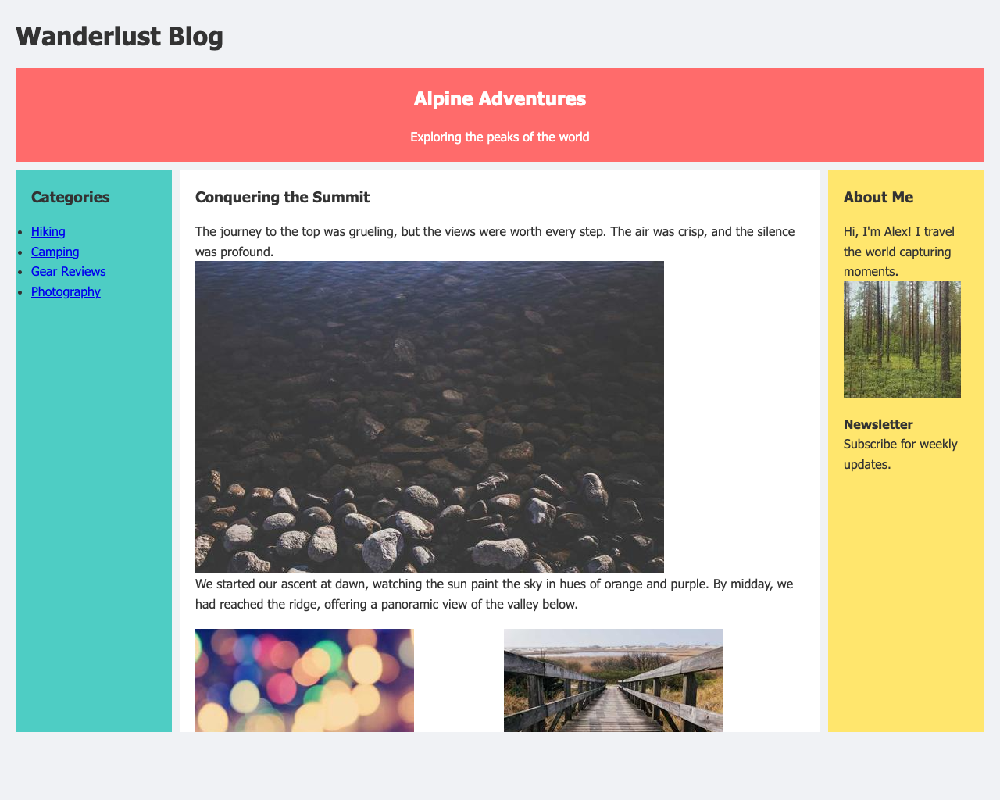
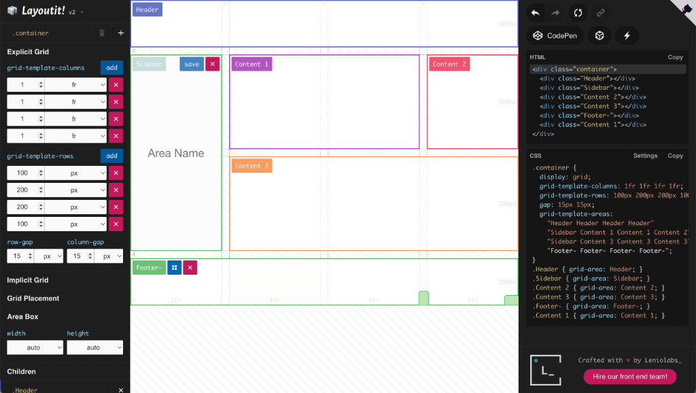
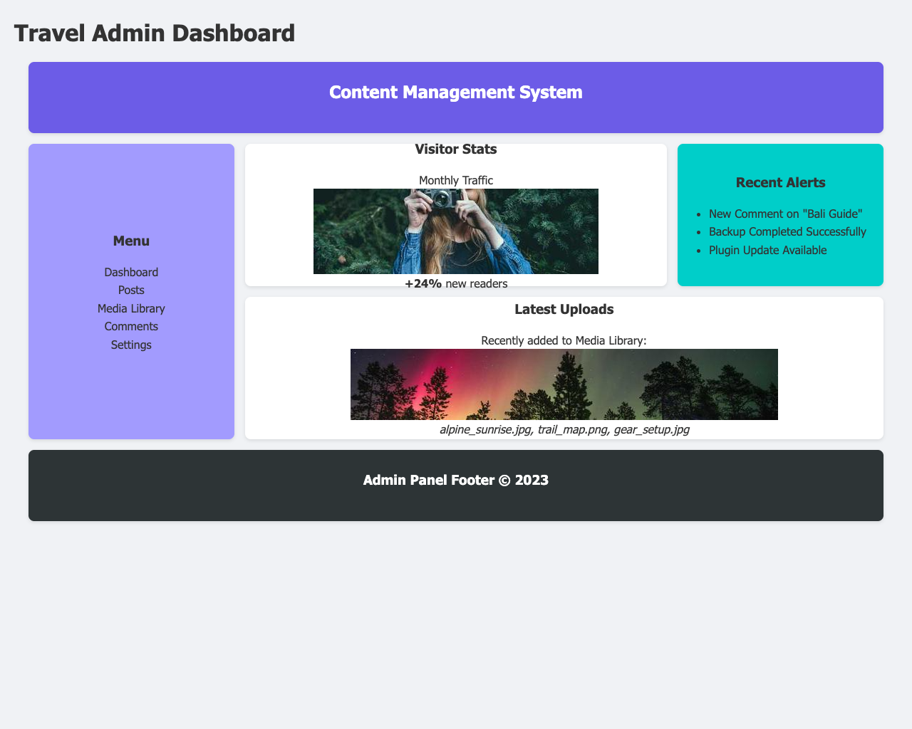
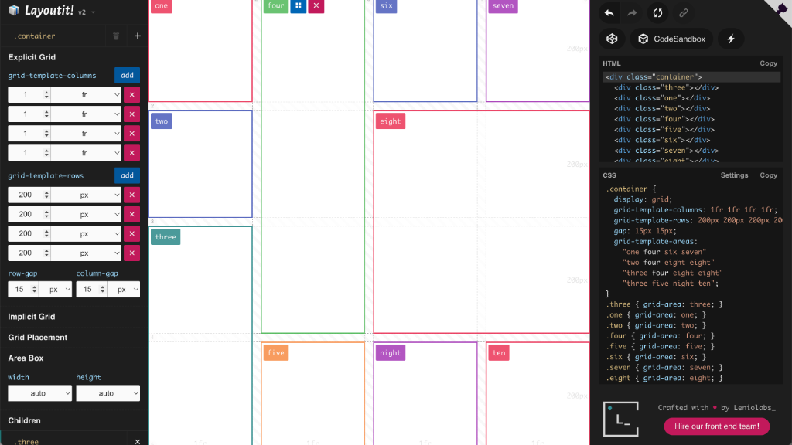
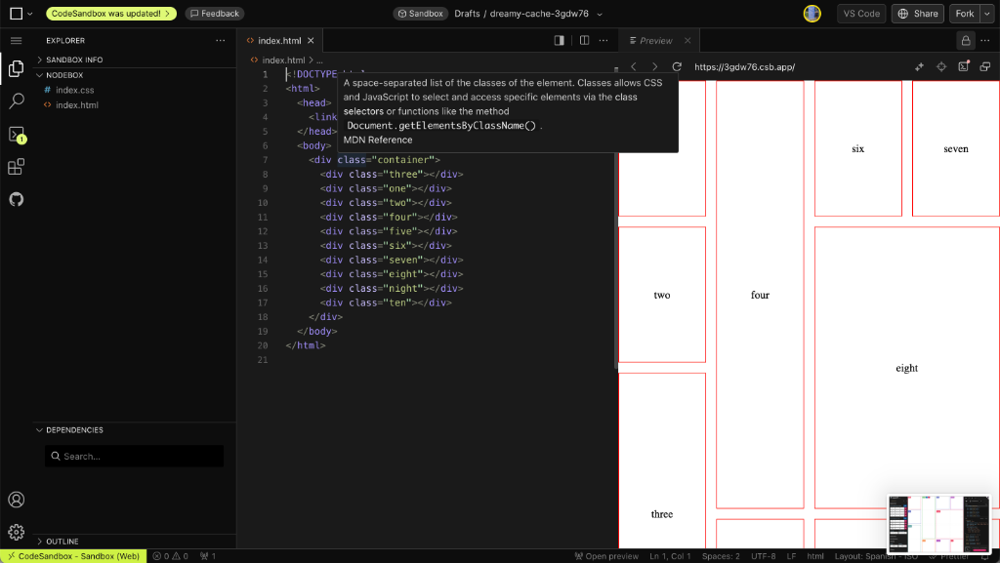

# week10 Homework Report: CSS Grid Layouts

**Student Name:** [Your Name]
**Course:** Dynamic Documents and Front-End Web Development
**Date:** [Current Date]

## Overview
This homework assignment involves creating three distinct web layouts using CSS Grid, based on principles of web design. The layouts demonstrate the versatility of CSS Grid for creating responsive, complex, and standard web structures.

## Layout 1: Holy Grail Layout
The "Holy Grail" layout is a classic web design pattern consisting of a header, footer, and a main content area flanked by two sidebars (navigation and ads/secondary content).

**Implementation Details:**
- **Grid Structure:** 3 columns (200px - 1fr - 200px) and 3 rows (100px - 1fr - 80px).
- **Responsiveness:** Collapses to a single column on smaller screens.
- **Usage:** Ideal for blogs, news sites, and documentation.

### Core Structure Code
**HTML:**
```html
<!DOCTYPE html>
<html>
  <head>
    <link href="index.css" rel="stylesheet" />
  </head>
  <body>
    <div class="container">
      <div class="header"></div>
      <div class="footer"></div>
      <div class="nav"></div>
      <div class="main"></div>
      <div class="aside"></div>
    </div>
  </body>
</html>
```

**CSS:**
```css
.container {
  display: grid;
  grid-template-columns: 200px 1fr 200px;
  grid-template-rows: 100px 1fr 80px;
  gap: 10px 10px;
  grid-auto-flow: row;
  grid-template-areas:
    "header header header"
    "nav main aside"
    "footer footer footer";
}

.header { grid-area: header; }
.footer { grid-area: footer; }
.nav { grid-area: nav; }
.main { grid-area: main; }
.aside { grid-area: aside; }

html, body , .container {
  height: 100%;
  margin: 0;
}
```

### Design & Structure



### Final Implementation


## Layout 2: Dashboard Layout
A dashboard layout typically requires a more complex grid to organize various widgets, charts, and data points.

**Implementation Details:**
- **Grid Structure:** 4x4 grid with spanning cells.
- **Features:** Sidebar for navigation, header for global actions, and various content widgets.
- **Usage:** Admin panels, analytics dashboards, and SaaS applications.

### Core Structure Code
**HTML:**
```html
<!DOCTYPE html>
<html>
  <head>
    <link href="index.css" rel="stylesheet" />
  </head>
  <body>
    <div class="container">
      <div class="Header"></div>
      <div class="Sidebar"></div>
      <div class="Content 2"></div>
      <div class="Content 3"></div>
      <div class="Footer-"></div>
      <div class="Content 1"></div>
    </div>
  </body>
</html>
```

**CSS:**
```css
.container {
  display: grid;
  grid-template-columns: 1fr 1fr 1fr 1fr;
  grid-template-rows: 100px 200px 200px 100px;
  gap: 15px 15px;
  grid-auto-flow: row;
  grid-template-areas:
    "Header Header Header Header"
    "Sidebar Content 1 Content 1 Content 2"
    "Sidebar Content 3 Content 3 Content 3"
    "Footer- Footer- Footer- Footer-";
}

.Header { grid-area: Header; }
.Sidebar { grid-area: Sidebar; }
.Content\ 2 { grid-area: Content 2; }
.Content\ 3 { grid-area: Content 3; }
.Footer- { grid-area: Footer-; }
.Content\ 1 { grid-area: Content 1; }

html, body , .container {
  height: 100%;
  margin: 0;
}
```

### Design & Structure


### Final Implementation


## Layout 3: Masonry Gallery
A masonry layout is popular for image galleries where items have varying aspect ratios.

**Implementation Details:**
- **Grid Structure:** Uses `grid-template-columns: repeat(auto-fill, minmax(250px, 1fr))` for responsiveness.
- **Features:** `grid-auto-flow: dense` allows smaller items to fill gaps left by larger ones.
- **Usage:** Portfolios, photo galleries, and Pinterest-style feeds.

### Core Structure Code
**HTML:**
```html
<!DOCTYPE html>
<html>
  <head>
    <link href="index.css" rel="stylesheet" />
  </head>
  <body>
    <div class="container">
      <div class="three"></div>
      <div class="one"></div>
      <div class="two"></div>
      <div class="four"></div>
      <div class="five"></div>
      <div class="six"></div>
      <div class="seven"></div>
      <div class="eight"></div>
      <div class="night"></div>
      <div class="ten"></div>
    </div>
  </body>
</html>
```

**CSS:**
```css
.container {
  display: grid;
  grid-template-columns: 1fr 1fr 1fr 1fr;
  grid-template-rows: 200px 200px 200px 200px;
  gap: 15px 15px;
  grid-auto-flow: row;
  grid-template-areas:
    "one four six seven"
    "two four eight eight"
    "three four eight eight"
    "three five night ten";
}

.three { grid-area: three; }
.one { grid-area: one; }
.two { grid-area: two; }
.four { grid-area: four; }
.five { grid-area: five; }
.six { grid-area: six; }
.seven { grid-area: seven; }
.eight { grid-area: eight; }
.night { grid-area: night; }
.ten { grid-area: ten; }

html, body , .container {
  height: 100%;
  margin: 0;
}
```

### Design & Structure



### Final Implementation


## Tools Used
- **CSS Grid:** For main layout structure.
- **LayoutIt:** Used to prototype the grid areas.
- **Visual Studio Code:** For development.
